# gtm-test-site
Testmiljö för implementering av GTM och spårning. Del av kursen i Webbanalys./ Test site for GTM and GA4 implementation exercises.

# 🏷️ My GTM Project

Here is how my tracking works (Legal & GDPR Safe):

```mermaid
graph TD
    User(Visit Site) --> Consent{Accept Cookies?}
    Consent -- YES --> GTM[🚀 GTM Fires Tags]
    Consent -- NO --> Block[🛑 No Data Sent]
    GTM --> GA4(Google Analytics)

```

📊 Measurement Plan (Tagging Strategy)

Event Name Trigger Type Parameters Business Goal
begin_checkout Click (ID: #cta-button) currency, value Track user intent to buy
file_download Click (Link: .pdf) file_name Monitor CV downloads
outbound_click Click (Link: external) link_url Measure exit traffic to Google
cookie_consent_update CMP Interaction

## 🛠️ Tech Stack

